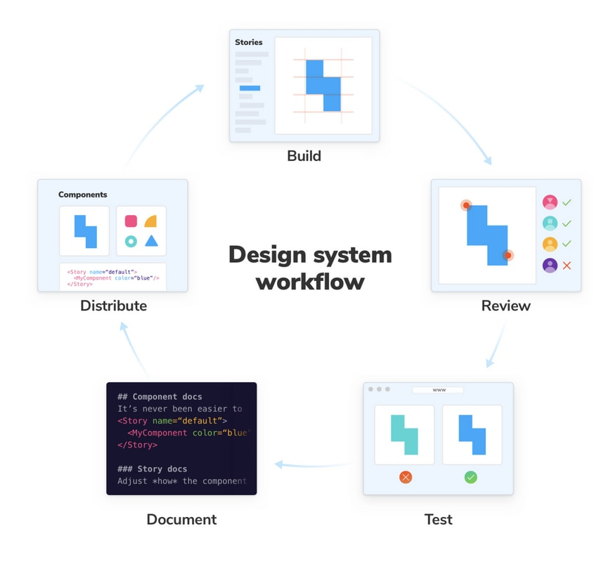
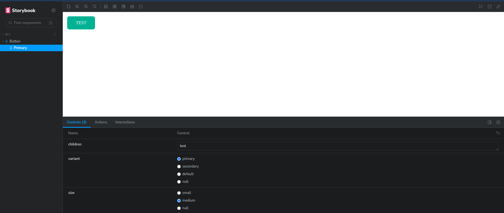
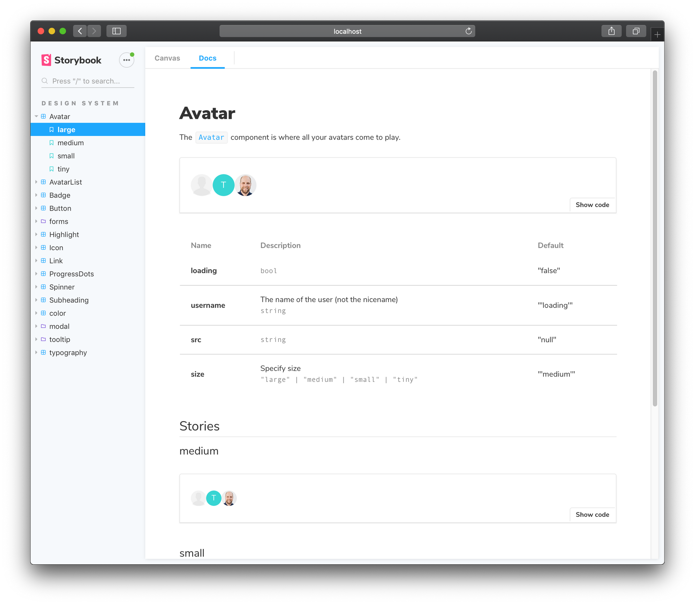

**دیزاین سیستم چیه ؟** دیزاین سیستم به یه سری اصول٬ کامپوننت و قوانینی که ظاهر اپلیکیشن و تجربه کاربری برنامه مارو در بر میگیره٬ میگن. به طور مثال دکمه ها یا اندازه متن ها.

## چرا باید اصلا از دیزاین سیستم استفاده کنیم ؟

بدون وجود دیزاین سیستم هر نیروی بر اساس سلیقه شخصی، ایده ها و *convention* خودش یک طرح رو پیاده سازی میکنه و این به مرور کد رو خیلی کثیف و غیرقابل *maintain* میکنه در اصل دیزاین سیستم راه حلی برای یکپارچه کردن طراحی محصول بین تیم فنی٬ طراحان و مدیریت است تا تجربه کاربری واحدی رو به کاربر نهایی انتقال بدیم چون معمولا در حین توسعه نرم افزار معمولا ui/ux در خلال کار گم میشه و باید ساز و کاری وجود داشته باشه که در هرجای فاز توسعه امکان بررسی *component* های پیاده شده با *guideline* برند باشه، **دیزاین سیستم** همون راه حله

 همچنین توی پروژه ای که تعداد کامپوننت ها زیاد میشه اگه به صورت ساختار مندی پیش نرفته باشیم٬ خیلی کامپوننت ها شلوغ میشه و تسک ها فرسایشی جلو میره و maintain پروژه٬ سخت و سختر میشه.

> اگر شما یک تیم ۱۰ نفره دارید و دیزاین سیستم واحدی ندارید این به این معنی هستش که ۱۰ تا دیزاین سیستم یا شایدم بیشتر دارید 

نمونه دیزاین سیستم در فیگما:

چرخه دیزاین سیستم که توی تیممون

## ساخت دیزاین سیستم از ابتدا

وقتی میخوایم دیزاین سیستم رو از اول بسازیم معمولا بین دو گزینه باید انتخاب کنیم

1. همه کدهارو خودمون بنویسیم
2. فریم ورک های مثل `ant.d, MUI` رو سفارشی سازی کنیم و زمان زیادی رو صرف تطابق دادن به طرح کنیم.

باید دنبال یک راه حل بینابینی باشیم. راه حلی که به نظرم هست استفاده از راه حل اول + کتابخونه های *headless*

> *headless* در اصطلاح به کتابخونه‌های میگن که فقط منطق و js رو هندل میکنه و ui خاصی نداره. این باعث میشه چیزهای مثل *modal* *Collapse* و خیلی چیزهای دیگه رو لازم نباشه روی ساخت اولیه اش وقت بزاریم یعنی [چرخ رو از اول اختراع](https://fa.wikipedia.org/wiki/%D8%A7%D8%AE%D8%AA%D8%B1%D8%A7%D8%B9_%D8%AF%D9%88%D8%A8%D8%A7%D8%B1%D9%87_%DA%86%D8%B1%D8%AE) نکنیم

برای ساخت دیزاین سیستم ما از چند کتابخونه استفاده میکنیم.

1. `tailwind` 
2. `cva`
3. ‍`storybook`  
4. ‍`headless/ui` 
5. `jest` and `react testing-library`

اول از همه برای اینکه خیالمون برای مسیر دهی راحت و تمیز باشه. میایم `alias` برای مسیرمون توی فایل `tsconfig.json` مینویسیم

~~~json
"paths": {
      "@ui/*": ["./src/components/ui/*"]
    }
~~~

و بعد تمام پکیج هارو به پروژه اضافه میکنیم

~~~bash
yarn add tailwindcss cva@npm:class-variance-authority storybook @headlessui/react
~~~

> این سینتکس ‍` cva@npm:class-variance-authority ` برای اینه که میخوایم یک پکیج رو با یه اسم دیگه در لوکال داشته باشیم یعنی به جای اینکه در ایمپورت بنویسیم ‍ ‍‍‍`class-variance-authority` مینویسیم `CVA`

ساختار پوشه بندی :

~~~
src/
└── components/
    └── ui/
        └── Button/
            ├── index.tsx
            ├── button.test.tsx
            └── button.stories.tsx
     └── template/
     └── layout/
~~~

### قدم اول. ساختار اولیه

ساختار اولیه دکمه رو ایجاد میکنیم

~~~typescript
default function Button() {
  return (
    <button>Button</button>
  )
}
~~~

### قدم دوم. ساخت انواع دکمه

دکمه میتونه حالت های مختلفی داشته باشه مثلا `outline` یا `primary` یا حتی اندازه های مختلفی میتونه داشته باشه باید تمام حالت های که در دیزاین سیستم هست رو پیاده کنیم

~~~typescript
import React from 'react';

// Define the ButtonProps interface
interface ButtonProps {
  intent?: 'primary' | 'secondary' | 'default';
  size?: 'small' | 'medium' | 'large';
  roundness?: 'square' | 'round' | 'pill';
}

// Create the Button component
const Button: React.FC<ButtonProps> = ({
  intent = 'default',
  size = 'medium',
  roundness = 'round',
  children,
}) => {
  // Define the mapping of variant styles
  const variantStyles: { [key: string]: string } = {
    primary: 'bg-green-500 hover:bg-green-600',
    secondary: 'bg-red-500 hover:bg-red-600',
    default: 'bg-gray-500 hover:bg-gray-600',
  };

  const sizeStyles: { [key: string]: string } = {
    small: 'text-sm py-1 px-2',
    medium: 'text-base py-2 px-4',
    large: 'text-lg py-4 px-8',
  };

  const roundnessStyles: { [key: string]: string } = {
    square: 'rounded-none',
    round: 'rounded-md',
    pill: 'rounded-full',
  };

  const getButtonStyle = (): string => {
    const intentStyle = variantStyles[intent] || variantStyles['default'];
    const sizeStyle = sizeStyles[size] || sizeStyles['medium'];
    const roundnessStyle = roundnessStyles[roundness] || roundnessStyles['round'];

    return `h-fit text-white uppercase transition-colors duration-150 ${intentStyle} ${sizeStyle} ${roundnessStyle}`;
  };

  return (
    <button
      className={getButtonStyle()}
    >
      {children}
    </button>
  );
};

export default Button;
~~~

 توی مثال بالا حجم کد خیلی بالاس و از طرفی اگر بخواهیم مثلا وقتی size برایر medium بود **و** intent هم بود یه کلاس دیگه هم اضافه کنیم کلی کد دیگه هم باید اضافه کنیم.اینجاس که `CVA` وارد بازی میشه مثال بالا رو با `CVA` دوباره مینویسیم

~~~typescript
import { cva } from "class-variance-authority";
import type { FC } from 'react';

const ButtonVariants = cva(
    /* button base style */
    "h-fit text-white uppercase transition-colors duration-150",
    {
        variants: {
            /* button colors */
            intent: {
                primary:
                    "bg-green-500 hover:bg-green-600",
                secondary:
                    "bg-red-500 hover:bg-red-600",
                default:
                    "bg-gray-500 hover:bg-gray-600",
            },

            /* button sizes */
            size: {
                small: ["text-sm", "py-1", "px-2"],
                medium: ["text-base", "py-2", "px-4"],
                large: ["text-lg", "py-4", "px-8"],
            },

            /* button roundness */
            roundness: {
                square: "rounded-none",
                round: "rounded-md",
                pill: "rounded-full",
            },
        },

        // default parameter
        defaultVariants: {
            intent: "default",
            size: "medium",
            roundness: "round"
        },
    }
);

export interface ButtonProps
  extends React.ButtonHTMLAttributes<HTMLButtonElement>,
  VariantProps<typeof ButtonVariants> {
}

const Button: FC<ButtonProps> = (props) => {
  const { size, variant, className } = props;
  return (
    <button type='button' {...props} className={buttonStyles({ variant, size, className })} />
  );
};
~~~

با کمک cva دیگه لازم نیست interface خاصی هم تعریف کنیم یه interface خالی که از دکمه html و مقدارهای CVA ارث بری میکنه.

خب توی ساخت دیزاین سیستم ممکنه بخواهید که چیزهای رو پیاده کنید که منطق هم دارن و در وب خیلی رایج هستند مثلا پیاده سازی select یا dropdown یا modal و مثال های مثل این، برای اینجور مواقع میتونید از کتابخونه‌های headless که استایل خاصی ندارن و خیلی خوب سفارشی سازی میشن استفاده کنید مثلا`headless/ui`  یا `radix/ui` 

### قدم سوم. storybook

بعد از اینکه حالت های مختلف دکمه زده شد باید در جایی به صورت ایزوله قرار بگیره که دیزاینر ها نظرشون رو بگن و ما اصلاحات رو انجام بدیم برای ایجاد همچین فضای میتونیم از [storybook](https://storybook.js.org/) استفاده کنیم. 

با استفاده از command های زیر کانفیگ اولیه اش انجام میشه

~~~bash
npx storybook@latest init
~~~

خب بعد از کانفیگ ما باید برای کامپوننتمون یک مستند بنویسیم به صورتی که برای storbook قابل فهم باشه. کنار فایل کامپوننتمون یک فایل به اسم `button.stories.tsx` ایجاد میکنیم.

#### نوشتن story

استوری نوشتن داستان یک کامپوننت است که چه ورودی های می گیرد و چه چیزی در به end user نشان میدهد
~~~typescript
// Button.stories.ts|tsx

import type { Meta, StoryObj } from '@storybook/react';

import Button from '.';

const meta: Meta<typeof Button> = {
  component: Button,
  title: 'UI/Button'
};

export default meta;
type Story = StoryObj<typeof Button>;

export const Primary: Story = {
  args: {
    children: 'تست'
  },
};
~~~

حالا با دستور زیر میتونیم ببینیم چه اتفاقی افتاده
~~~bash
yarn storybook
~~~

خروجی هم به این صورت میشه

همیچنین storybook قابلیت این رو داره که برای هر کامپوونتون [مستندات](https://github.com/storybookjs/storybook/tree/next/addons/docs) نمیزی بنویسید و خروجی مثل زیر داشته باشید

### قدم چهارم. نوشتن تست

بعد از اینکه کد ریویو و ریویو طرح توسط طراح ها انجام شد و تغییراتش انجام شد در مراحل آخر باید *unit test* برای کامپوننت‌مون بنویسیم تا حالت های مختلفش رو تست کنیم. از کتابخونه های مثل  `jest, react-testing library` میتونیم استفاده کنیم. مثال برای کامپوننت‌مون :

~~~typescript
import { fireEvent, render, screen } from '@testing-library/react';
import React from 'react';

import Button from '.'; // Replace './Button' with the correct path to your Button component

describe('Button Component', () => {
  it('renders with default variant and size', () => {
    render(<Button>Click Me</Button>);

    const buttonElement = screen.getByRole('button');
    expect(buttonElement).toHaveClass('bg-gray-500');
    expect(buttonElement).toHaveClass('text-base');
    expect(buttonElement).toHaveClass('rounded-md');
    expect(buttonElement).toHaveTextContent('Click Me');
  });

  it('applies the correct variant and size styles', () => {
    render(<Button variant='text' size='small'>Primary Button</Button>);

    const buttonElement = screen.getByRole('button');
    expect(buttonElement).toHaveClass('bg-green-500');
    expect(buttonElement).toHaveClass('text-lg');
    expect(buttonElement).toHaveClass('rounded-full');
    expect(buttonElement).toHaveTextContent('Primary Button');
  });

  it('calls the onClick callback when clicked', () => {
    const onClickMock = jest.fn();
    render(<Button onClick={onClickMock}>Click Me</Button>);

    const buttonElement = screen.getByRole('button');
    fireEvent.click(buttonElement);

    expect(onClickMock).toHaveBeenCalledTimes(1);
  });
});
~~~

### جمع بندی

 برای جمع بندی، این مقاله مقدمه ای برای ساختن دیزاین سیستم های بود یادتون باشه به ازای هر پروژه تصمیم درستی بگیرید نه یک تصمیم را برای هر پروژه استفاده کنید ممکنه این تصمیم برای پروژه های کوچیک [Overengineering](https://en.wikipedia.org/wiki/Overengineering) باشه. ممنونم که این بلاگ پست رو خوندید امیدوارم حاوی نکته‌ای آموزنده ای براتون بوده باشه :)

##### منابع

- https://blog.nimbleways.com/building-utility-first-design-systems-with-tailwind/
- https://www.youtube.com/watch?v=T-Zv73yZ_QI
