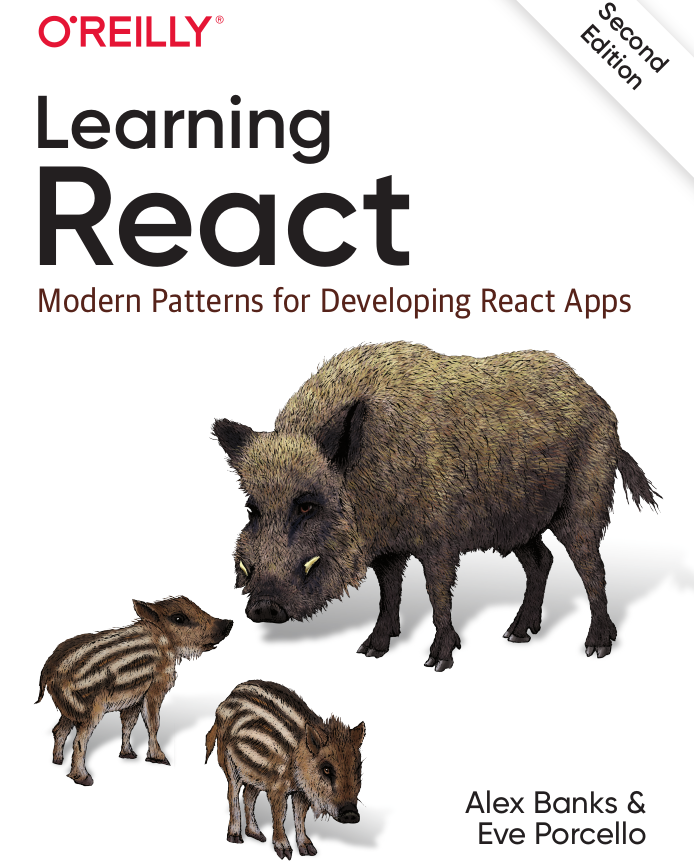

# کتاب Learning react

توی پست ها معرفی کتاب اصلا قصد ندارم خلاصه کتابی رو بزارم چون بنظرم خلاصه به این معنی که با خوندن این پست دیگه لازم نیست اون کتاب اصلی رو بخونید. در عوض میایم در مورد این صحبت میکنیم که کتاب چی میخواد بگه و از کجا به کجا میخواد برسه تا اگر خوشت اومد خودتون بخونید :)

خب بریم سراغ کتاب، این جلدش هست

دوست دارم معرفی را با بخشی از متن کتاب شروع کنم

> فرقی نمیکنه که تازه ری اکت رو میخواید شروع کنید یا به ری اکت مسلط هستید این کتاب چیزی برای یاد دادن به شما داره. 

به نظرم این گذاره تا حدی درست بود چون کتاب در حین حال که ساده است نکات خوبی رو هم میگه،یکی از نقاط قوی کتاب اینه که جریان خوبی داره، یعنی ترتیب سرفصل‌ها و مثال های خوب و به جایی که داره میتونه در فهمیدن و یا بهتر فهمیدن React بهتون خیلی کمک کنه. البته این کتاب(نسخه دومش) برای سال 2020 هست ممکنه بعضی از سرفصل هاش قدیمی شده بشه ولی چیزی که ثابته اون [نحوه فکر کردن در ری اکت](https://react.dev/learn/thinking-in-react) که خیلی خوب توضیح میده.یه نگاه خیلی گذرا به سرفصل هاش میندازیم :

**فصل اول** مثل خیلی کتاب های دیگه میاد در مورد پیدایش ری اکت صحبت میکنه و تاریخچه‌اش رو میگه **فصل دوم** خیلی مناسب کسایی هست که میخوان تازه ری اکت رو شروع کنن و دانش js خیلی ندارن.

**فصل سوم**، فصل مورد علاقه من توی این کتاب دقیقا همین فصله،
 توی این فصل در مورد مفاهیمی مثل functional prgramming صحبت میکنه. و چرا این فصل مهمه ؟ چون [الگوی](https://en.wikipedia.org/wiki/Programming_paradigm) که react,js دنبال میکنن همینه.
با درست فهمیدن این فصل، طرز فکر در react,js رو یاد میگیرم. به همین علت هم هست که میگم کتاب جریان خوبی داره چون دقیقا قبل از اینکه وارد ری اکت بشه. اون فلسفه‌ی [فکر کردن در ری اکت](https://react.dev/learn/thinking-in-react) خیلی خوب توضیح میده.

**فصل چهارم** توی این قسمت خیلی جدی وارد ری اکت نمیشه و ری اکت با cdn اضافه میکنه به html و مفاهیم خیلی ابتدایی مثل رندر یا component رو خیلی خوب توضیح میده.

**فصل پنجم** توی این فصل میاد کامپوننت هارو با JSX مینویسه و در مورد babel,webpack صحبت میکنه و اینکه چرا باید ازش استفاده کنیم. و چه بلایی سر کدهای ری اکتیمون میاد

**فصل ششم** میاد در مورد اینکه چجوری کامپوننت ها با state ها داینامیک کنیم و ساخت فرم ها و فیلد های control شده و context دوست داشتنی در react بهمون میگه.

**فصل هفتم** خیلی فصل پرباری در مورد هوک هاست در مورد هوک ها و custom hookها صحبت میکنه، در مورد performance توی app های reactای صحبت میکنه و کی باید از memo استفاده کنیم و هوک های مثل usememo, uselayouteffect, , usereducer را با سناریوهای استفاده‌شون توضیح میده.

**فصل هشتم** میپردازه به ریکوست زدن به backend و نکات خوبی هم اینجا میگه مثل virtual list و یه مقدمه ای هم از graphql میگه

**فصل نهم** به نظرم این فصل علیرقم مهم بود موضع هاش، خوب توضیح داده و یکی از نقاط ضعف کتاب همین فصله که در مورد error boundary, code spiliting و suspense صحبت میکنه.

**فصل دهم** عنوان فصل تست نویسی هستش ولی ابزارهای رو هم بهتون میگه که کیفیت کد نویسی تون در حین توسعه افزایش میده

**فصل یازدهم** بالاخره رسیدیم به react-router توی این فصل در مورد چگونگی ایجاد nested route و خوده routing صحبت میکنه.

**فصل دوازدهم** یک مقدمه ای ۱۵ صفحه ای برای بحث SSR داره که به نظرم کافیه ابزارهای مثل gatsby,nextjs رو معرفی میکنه

  امیدوارم این پست براتون مفید بوده باشه :)

