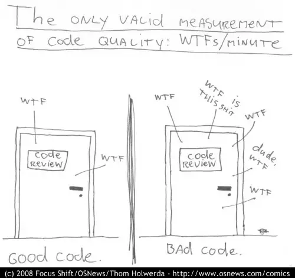

نوشتن کد تمیز قابلیت maintain پروژه و بهره‌وری تیم فنی رو افزایش میده. البته کد تمیز به این معنی نیست که یکی کدتون رو ببینه نگه wtf بلکه توی اینه که تعداد wtf هارو کاهش بدیم.



توی این پست میخوام چندتا نکته در مورد نوشتن کد تمیز بگم

## نام گذاری

نام گذاری یکی از مهم ترین کارهای که هر روز باهاش سر و کار داریم. بعضی وقتا انتخاب یه نام خوب خیلی چالش برانگیز میشه.


۱. نام گذاری باید بگه چرا وجود داره و اینکه چیکار میکنه البته در موارد توابع باید رفتار رو بگه. اگر یک نام گذاری نیاز به کامنت یا توضیح داره یعنی خوب نیست٬ در ضمن توی نام گذاری از slang و مخفف استفاده نکنید

```jsx
// BAD
ePay
// Good
employPaymentInfo
```

۲. اسم خوب ارتباط رو با بخش های دیگر برنامه مشخص میکنه. مشخصه گر‌های زیادی هستند که ما از اسم میفهمیم دیتای داخل اون چیه. مثلا:

1. اسم های که با ‍`is` شروع میشن یک مقداره boolean هستن
2. مقادیری که با حروف بزرگ `BASE_URL` نوشته میشن٬ یعنی یک ثابت هستند.
3. متغیرهای که جمع هستند `users` نشون دهنده این هستند که حاوی یک آرایه هستند.
4. توابعی که با `get`, `select` یا `find` هستند معمولا یک خروجی دارن ولی توابعی که با ‍`process` `run` یا `build` هستن خروجی خاصی ندارند.


۳. از اسم های قابل تلفظ استفاده کنید. تا هم بتونید به هم تیمیتون اسمش رو بگید هم یادتون بمونه.

```jsx
// BAD
const dobyymm
// GOOD
const DateOFBirthInYearsMonths
```

۴. از اسم های قابل سرچ استفاده کنید(یونیک بودن). مثلا توی مثال زیر اون عدده چیه واقعا ؟

```jsx
// What the heck is 86400000 for?
setTimeout(blastOff, 86400000);

// Declare them as capitalized named constants.
const MILLISECONDS_PER_DAY = 60 * 60 * 24 * 1000; //86400000;

setTimeout(blastOff, MILLISECONDS_PER_DAY);
```

۵. برای اسم فانکشن ها از افعال استفاده کنید مثلا

```jsx
function postPayment() {}
```

۶. پیوستگی داشته باشید. مثلا اگر همه جا برای اسم کنترلر ها از **Controller** استفاده میکنید. یا مثلا اگر برای متدهای که ریکوست به سرور میزنن اول آن ها get یا fetchمیگذارید برای همه متد ها این کار را انجام دهید

برای اینکه این این پیوستگی بین اعضای تیم حفظ بشه باید یک styleguide همراه با مثال داخل read me پروژه بنویسیم

۷. از کلمات نویز مثل of the a an توی نام گذاری ها استفاده نکنید چون هیچ معنی ندارن.

۸. از نام های قابل تشخیص استفاده کنید مثلا فرق messages و messagesList در چیست.

۹. ورودی دیفالت از چک کردن خیلی تمیز تره. مثال

**بد:**

```jsx
function createMicrobrewery(name) {
  const breweryName = name || "Hipster Brew Co.";
  // ...
}
```

**خوب:**

```jsx
function createMicrobrewery(name = "Hipster Brew Co.") {
  // ...
}
```


## توابع

۱. توابع باید **کوچک** باشند تعداد خط باید کوتاه باشند.

۲. مطمئن باشید تابع فقط **یک کار** میکنه.

از کجا میتونیم بفهمیم تابعمون یک کار میکنه ؟ فقط یک **دلیل** داره که اون رو عوض کنیم

۳. سطح تو رفتگی داخل تابع نباید از **۲تا** بیشتر باشه

۴. تابع نباید **ساید افکت** داشته باشه. چیزی رو نباید تغییر بده از بیرون.

```jsx
// Bad:
const addItemToCart = (cart, item) => {
  cart.push({ item, date: Date.now() });
};

// Good:
const addItemToCart = (cart, item) => {
  return [...cart, { item, date: Date.now() }];
};
```

اگر آرایه به تابعی پاس میدید به جای اینکه روی آرایه اصلی تغییر ایجاد کنید یک آرایه جدید return کنید

۵. از switch داخل تابع ها استفاده نکنید. چون توی switch که میزاریم مجبور یک چند حالت یک چیز رو چک میکنیم پس اصل تک مسولیتی رو زیر سوال میبره و اصل open close چون هربار که یک نوع جدیدی وارد میشه باید تغییر میکند.

به جاش میتونید از map کردن استفاده کنید. مثلا

```jsx
// Bad 😕
const getServerUrl = (env) => {
  switch (env) {
    case "prod":
      return "prod.myweb.com";
    case "test":
      return "test.myweb.com";
    case "staging":
      return "staging.myweb.com";
    default:
      return "https://localhost:3000";
  }
};

// Better 😀
const serverUrls = {
  prod: "prod.myweb.com",
  test: "test.myweb.com",
  staging: "staging.myweb.com",
};

const getServerUrl = (env) => serverUrls[env]
```

۶. متد ها با این نکته که فقط باید یه کار انجام بده **۲یا ۳ ورودی میتونه بگیره.** ولی میشه از destructering استفاده کرد

۷. موقعی که در ارور ها هستیم به جای لاگ کردن اون **ارور raise کن** تا دیباگ آسون تر و سریعتری داشته باشی و اینکه هندل کردن خطا خودش یک کاره و باید متد جداگانه داشته باشه

۸. از فلگ توی تابع هاتون استفاده نکنید چون این نشون دهنده اینه که تابع تون چندتا کار میکنه

```jsx
// BAD
function createFile(name, temp) {
  if (temp) {
    fs.create(`./temp/${name}`);
  } else {
    fs.create(name);
  }
}

// Good
function createFile(name) {
  fs.create(name);
}

function createTempFile(name) {
  createFile(`./temp/${name}`);
}
```

۹. شرط هاتون رو کپسوله کنید تا معنی دار تر بشند

```jsx
function shouldShowSpinner(fsm, listNode) {
  return fsm.state === "fetching" && isEmpty(listNode);
}

if (shouldShowSpinner(fsmInstance, listNodeInstance)) {
  // ...
}
```

## کامنت ها

۱. کامنت کد بد رو درست نمیکنه

۲. کامنت خوب، کامنتیه که ما با کد و یا اصلاح کد نمیتونیم اون اطلاعات رو به کاربر برسونیم

اگه  غیر این باشه بهش میگن کامنت نویز٬ کامنت نویز به کامنتی میگن که اطلاعات جدیدی به کاربر نمیده

```jsx
public class Pizza {
    // The ID of the pizza
    private int id;

    // The list of ingredients
    List<Ingredient> ingredients;

    // Default constructor
    Pizza()
    {
        // ...
    }
```


## تست نویسی

توی هر تست فقط و فقط یک سناریو باید تست بشه و کمترین حد وابستگی باید بین تست ها باشه طوری که ترتیب اجراشون مهم نباشه

****بد****

```jsx
import assert from "assert";

describe("MomentJS", () => {
  it("handles date boundaries", () => {
    let date;

    date = new MomentJS("1/1/2015");
    date.addDays(30);
    assert.equal("1/31/2015", date);

    date = new MomentJS("2/1/2016");
    date.addDays(28);
    assert.equal("02/29/2016", date);

    date = new MomentJS("2/1/2015");
    date.addDays(28);
    assert.equal("03/01/2015", date);
  });
});
```

******خوب******

```jsx
import assert from "assert";

describe("MomentJS", () => {
  it("handles 30-day months", () => {
    const date = new MomentJS("1/1/2015");
    date.addDays(30);
    assert.equal("1/31/2015", date);
  });

  it("handles leap year", () => {
    const date = new MomentJS("2/1/2016");
    date.addDays(28);
    assert.equal("02/29/2016", date);
  });

  it("handles non-leap year", () => {
    const date = new MomentJS("2/1/2015");
    date.addDays(28);
    assert.equal("03/01/2015", date);
  });
});
```


## موارد عمومی

### از typescript استفاده کنید

مشخص کردن نوع ورودی و خروجی و رعایت قوانین سخت گیرانه تایپ اسکریپت باعث میشه به خودی خود٬ استفاده ازش باعث خوانایی کد بشه


### از eslint و prettier استفاده کن

ممکنه بعضی وقت ها یادت بره که تابعت نباید بیشتر از ۳ تا ورودی بگیره٬ میتونی از linter ها استفاده کنی که کدتو موقع تغییر بررسی کنن تا مشکل های اینجوری رو بهت یادآوری کنن.

prettier هم به تیم کمک میکنه که تا حدود زیادی یک دستخط کد داشته باشیم برای یک پروژه. البته حتما باید رو [هوک های گیت](https://git-scm.com/book/en/v2/Customizing-Git-Git-Hooks) set بشه که کد تر و تمیز بیاد برای code review

### از  promise به جای callback استفاده کن

کال بک ها راه حل تمیزی نیستند. به خاطر اینکه سطح تورفتگی کد رو زیاد میکنن.

البته فقط این هم نیست. برای مطالعه میتونید فرق بین `inversion of control`  و ‍‍`depdency injection` رو بخونید(شاید یه روز همین جا نوشتم)

### خودتو تکرار نکن

کد تکراری هیچ وقت نشونه خوبی نیست. اگر خودت رو تکرار کنی موقع به روز کردن یه متد یا کلاس باید جاهای خیلی زیادی رو عوض کنی

