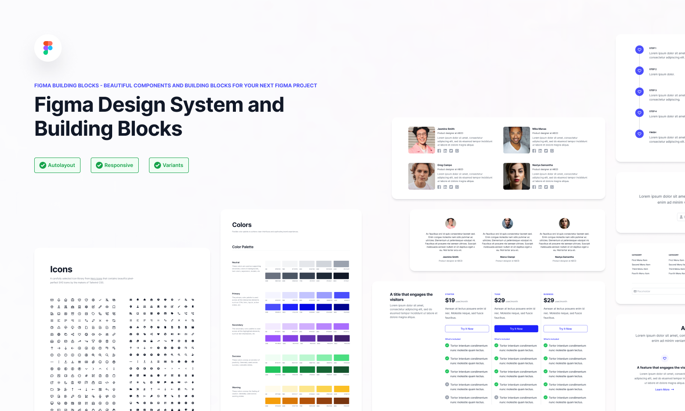

**دیزاین سیستم چیست ؟** دیزاین سیستم به یه سری اصول٬ کامپوننت و قوانینی که ظاهر اپلیکیشن و تجربه کاربری برنامه مارو در بر میگیره٬ میگن. به طور مثال دکمه ها یا اندازه متن ها.

## چرا باید اصلا از دیزاین سیستم استفاده کنیم ؟

دیزاین سیستم راه حلی برای یکپارچه کردن طراحی محصول بین تیم فنی٬ طراحان و مدیریت است تا تجربه کاربری واحدی رو به کاربر نهایی انتقال بدیم.

 همچنین توی پروژه ای که تعداد کامپوننت ها زیاد میشه اگه به صورت ساختار مندی پیش نرفته باشیم٬ خیلی کامپوننت ها شلوغ میشه و تسک ها فرسایشی جلو میره و maintain پروژه٬ سخت و سختر میشه.

همونطور که تیم فنی یک دیزاین سیستم ارائه میدن تیم فنی هم باید اینکارو بکنن تا تیم طراحی بتونه روی جزییات ریز نظرشو بگه.

نمونه دیزاین سیستم در فیگما:

به دو روش میشه دیزاین سیستم رو تعریف کرد

1. استفاده از کتابخونه های oponinated مثله mui یا ant.d که خیلی چیزهارو داخل خودش هندل کرده و آماده است و باید با قوانین اونا کار کنید.
2. استفاده از کتابخونه های سبک مثل tailwind 

اگه از روش اول استفاده کنیم باید خیلی سفارشی سازی کنیم تا چیزی که تیم ui/ux انتظار دارن رو برآورده کنیم و مشکل بعدی این کتابخونه ها اینه که خیلی سنگینه  و شامل خیلی چیزهای میشه که ممکنه اصلا توی پروژه استفاده نکنیم.

توی روش دوم سفارشی سازی نمیکنیم در اصل یک چیزی رو از اول میسازیم به خاطر همین خیلی انعطاف پذیر تر و سبک تره(نترسید چرخ رو از اول اختراع نمیکنیم :)) و فقط چیزهای رو میسازیم که لازم داریم. 

## ساخت دیزاین سیستم

برای ساخت دیزاین سیستم ما از چند تکنولوژی استفاده میکنیم.

1. `tailwind` : بخاطر اینکه براحتی میشه توی هر پروژه ای اضافه اش کرد و خیلی انعطاف پذیره و پر از utility class هست که راحت میشه باهاش دیزاین سیستم ساخت.
2. `cva` با استفاده از این کتابخونه میتونیم کلاس هامون رو به صورت شرطی اعمال کنیم
3. ‍`storybook`  با استفاده از این کتابخونه میتونیم مستندات کامپوننت رو بنویسیم و یه playground  ایزوله درست کنیم. که میتونیم داکامپوننت مون رو بیرون از کل برناممون تست کنیم.
4. ‍`radix.ui` برای کامپوننت های که فقط با کلاس نمیشه هندل کرد و نیاز به کارهای js ای داره میتونیم از این کتابخونه استفاده کنیم. فرقش با کتابخونه های بزرگ اینه که تو مثلا میتونی کامپوننت dialog رو کاملا جدا دانلود کنید.

اول از همه برای اینکه خیالمون برای مسیر دهی راحت و تمیز باشه. میایم `alias` برای مسیرمون توی فایل `tsconfig.json` مینویسیم

~~~json
    "paths": {
      "@ui/*": ["./src/components/ui/*"]
    }
~~~

ساختار پوشه بندی :

~~~text
src/
└── components/
    └── ui/
        └── Button/
            ├── index.tsx
            └── button.stories.tsx
~~~

